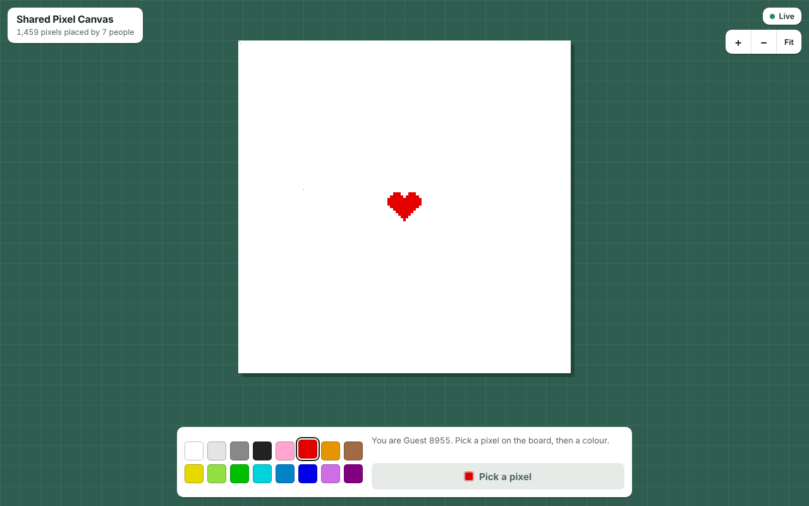
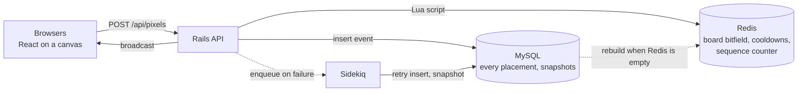

# Shared Pixel Canvas

A public board where anyone can place one coloured pixel every five seconds, and everyone watching sees it appear live. Built with Ruby on Rails, MySQL, Redis, Sidekiq and React.



The interesting part is underneath: many people writing to the same 512 by 512 board at once, with a definite winner for every pixel, a per-user cooldown that cannot be dodged, and a board that survives losing Redis completely.

## How it works



Redis holds the live board and decides the order of placements. MySQL holds the permanent history and can rebuild Redis at any time.

One placement:

1. The browser sends `POST /api/pixels` with `x`, `y` and `color`, and draws the pixel straight away.
2. Rails validates the values and identifies the guest from a signed cookie.
3. One Redis Lua script runs atomically. It checks the user's cooldown, starts a new one, writes four bits into the board and returns the next sequence number.
4. Rails inserts the placement, with its sequence number, into MySQL. If the insert fails, a Sidekiq job retries it.
5. Rails broadcasts `{seq, x, y, color, t}` over Action Cable.
6. Every other browser draws the pixel. If the server refused the placement, the placing browser puts the old colour back.

## Design decisions

**Redis decides order, MySQL keeps the record.** Redis runs one script at a time, so two people hitting the same pixel get a definite winner. The sequence number is stored with each event, and a rebuild replays events in that order, not in insert order. See [`place_pixel.lua`](api/config/redis/place_pixel.lua) and [`board_rebuilder.rb`](api/app/services/board_rebuilder.rb).

**The cooldown check and the pixel write share one script.** As separate commands, two fast requests from one user could both pass the check. A test sends 50 requests from one user at once and expects exactly one to succeed.

**The board is one bitfield.** At four bits per pixel the whole board is 131,072 bytes, read with a single `GET`. Gzip brings a mostly empty board down to a few hundred bytes on the wire.

**Clients subscribe before they fetch.** The browser opens the WebSocket and holds incoming pixels, fetches the board with its sequence number, then applies only the held pixels that are newer. Fetching first would lose anything placed during page load. Each pixel also remembers the last sequence number applied to it, so broadcasts that arrive out of order cannot leave the wrong colour behind. See [`boardState.ts`](client/src/lib/boardState.ts).

**The retry job is idempotent.** A unique index on the sequence number turns a repeated insert into a no-op.

**Snapshots bound the replay.** Every 5,000 placements the board bytes and their sequence number are saved to MySQL. A rebuild loads the latest snapshot and replays only the events after it.

**Guests, not accounts.** A visitor gets an identity on first load. The cooldown is per guest, and per-address limits (Rack::Attack) stop one address from minting guests to get around it.

## Run it locally

You need Docker.

```sh
docker compose up --build
```

Open http://localhost:5173. Open it in a second browser, or a private window, to watch two guests paint the same board.

| Service | Address | Notes |
| --- | --- | --- |
| Client (Vite) | http://localhost:5173 | Proxies `/api` and `/cable` to the API |
| API (Rails) | http://localhost:3000 | `GET /health` reports MySQL and Redis |
| MySQL 8.4 | internal | User `canvas`, created by `docker/mysql/init.sql` |
| Redis 7 | internal | Append-only persistence on |
| Sidekiq | internal | Retries, snapshots, rebuilds |

To draw a small heart on an empty board:

```sh
docker compose exec api bundle exec rake board:seed
```

The first run writes `api/Gemfile.lock`. Commit it so every machine and CI resolve the same gem versions.

## Tests

```sh
docker compose exec -e RAILS_ENV=test api sh -c "bundle exec rails db:prepare && bundle exec rspec"
docker compose exec client npm test
```

| Layer | Where | What it proves |
| --- | --- | --- |
| Bit layout | `api/spec/services/board_bits_spec.rb`, `client/src/lib/bits.test.ts` | Server and client agree on which half of a byte a pixel lives in |
| Placement script | `api/spec/services/board_store_spec.rb` | First and last pixel, neighbours untouched, cooldown, 50 parallel requests from one user, a definite winner on a contested pixel |
| Placement path | `api/spec/services/place_pixel_spec.rb` | Event stored with Redis's sequence number, one broadcast, retry job on a MySQL failure |
| Recovery | `api/spec/services/board_rebuilder_spec.rb`, `consistency_checker_spec.rb` | Identical board after Redis is wiped; snapshot and full replay give the same bytes; zero differences after 10,000 overlapping placements |
| HTTP | `api/spec/requests` | Status codes and bodies for every endpoint, including 401, 422, 429 and 503 |
| Client state | `client/src/lib/boardState.test.ts` | Out-of-order broadcasts, pixels placed during page load, optimistic paint and undo |

CI runs RuboCop, RSpec, the TypeScript check, Vitest and a production build on every push ([workflow](.github/workflows/ci.yml)).

## Recovery drill

```sh
docker compose exec api bundle exec rake board:check      # differences: 0
docker compose exec redis redis-cli flushall              # lose the live board
docker compose restart api                                # boot rebuilds it from MySQL
docker compose exec api bundle exec rake board:check      # differences: 0, same seq as before
```

`board:check` replays the full history from MySQL and compares it with the live board, pixel by pixel. It exits with status 1 on any difference.

A request that finds the board missing answers 503 with `Retry-After` and queues a rebuild, so the board also comes back without a restart. A browser that connects in the meantime shows "Restoring the board…" and retries on its own.

## Load test

The script in [`loadtest/placements.js`](loadtest/placements.js) uses [k6](https://k6.io). Each virtual user gets a guest session, holds a WebSocket open and places a pixel every cooldown inside a 64 by 64 square, so users constantly overwrite each other.

```sh
RATE_LIMIT_DISABLED=1 docker compose up -d      # every virtual user shares one address
k6 run -e SCENARIO=baseline loadtest/placements.js
k6 run -e SCENARIO=target   loadtest/placements.js
k6 run -e SCENARIO=spike    loadtest/placements.js
docker compose exec api bundle exec rake board:check
```

| Scenario | Virtual users | Duration |
| --- | --- | --- |
| baseline | 50 | 2 minutes |
| target | 200 | 5 minutes |
| spike | 0 to 1,000 in 30 seconds, then hold | 90 seconds |

### Results

Not measured yet. Fill this in from the k6 summary, and record the setup with the numbers: laptop results are not production claims.

| Scenario | Placements per second | `place_latency_ms` p50 / p95 / p99 | `broadcast_delay_ms` p95 | 5xx | `board:check` differences |
| --- | --- | --- | --- | --- | --- |
| baseline | | | | | |
| target | | | | | |
| spike | | | | | |

Setup: machine, Puma workers and threads, Rails environment, whether it ran in Docker.

Rebuild time from an empty Redis: `rake board:rebuild` prints the seconds taken and the number of events replayed.

`broadcast_delay_ms` is the time from the server's broadcast to the message arriving on a socket. It is only meaningful when k6 and the API share a clock.

## API

| Method and path | Purpose | Success | Errors |
| --- | --- | --- | --- |
| `GET /api/session` | The guest, cooldown left and board configuration; creates the guest on first call | 200 | 429 too many new sessions |
| `GET /api/board` | Raw board bytes; sequence number in `X-Board-Seq` | 200 | 503 while rebuilding |
| `POST /api/pixels` | Place a pixel: `{x, y, color}` | 201 `{seq, x, y, color, cooldown_ms}` | 401 no session, 422 invalid, 429 `{error, retry_after_ms}`, 503 while rebuilding |
| `GET /api/pixels/:x/:y` | Who placed the pixel now showing there | 200 | 404 never placed, 422 out of range |
| `GET /api/stats` | Total placements and users | 200 | |
| `GET /health` | MySQL and Redis reachable | 200 | 503 |

WebSocket: `/cable`, channel `BoardChannel`, server to client only. Each message is `{seq, x, y, color, t}`, where `t` is the server's time in epoch milliseconds.

Board bytes: pixel `i = y * width + x` is the high half of byte `i / 2` when `i` is even and the low half when odd. Colours are indexes into the 16-colour palette in [`config/board.yml`](api/config/board.yml), the one place the board's size, palette and cooldown are defined.

## Known limits

- **A placement can be lost if Redis loses everything at the wrong moment.** Redis accepts a pixel before MySQL stores it. If the insert is still pending when Redis loses its data, the rebuilt board will not include that pixel. Append-only persistence narrows the window; it does not close it.
- **A crash between Redis and MySQL leaves a pixel on the board with no row behind it.** `board:check` reports these as differences.
- **Nothing works without Redis.** Placements fail and live updates stop until it returns. The production Compose file restarts the containers, and boot rebuilds the board.
- **One Redis, one MySQL.** There is no replication or failover.
- **Every pixel is broadcast on its own.** With many viewers, fan-out is the first thing to saturate. Batching broadcasts every 100 ms is the next step.
- **`GET /api/stats` counts rows.** Fine at this size; a counter would be needed for a very large history.

## Not built yet

Timelapse replay of the history, a top-contributors leaderboard (Redis sorted set), batched MySQL writes, batched broadcasts, moderation rollback and GitHub sign-in.

## Deploying

`Dockerfile` at the repository root builds one image that serves the built client, the API and the WebSocket from a single origin. `docker-compose.prod.yml` runs it with MySQL, Redis and Sidekiq on one machine:

```sh
cp .env.example .env        # fill in SECRET_KEY_BASE and DB_PASSWORD
docker compose -f docker-compose.prod.yml up -d --build
```

Put a TLS-terminating proxy in front of port 3000 and set `FORCE_SSL=true`.

## Layout

```
api/                    Rails API
  app/services/         BoardStore, PlacePixel, BoardRebuilder, ConsistencyChecker
  app/channels/         BoardChannel
  app/jobs/             PersistPixelJob, SnapshotJob, RebuildBoardJob
  config/redis/         place_pixel.lua
  config/board.yml      Board size, palette, cooldown
  lib/tasks/board.rake  ensure, rebuild, check, snapshot, seed
client/                 React and TypeScript client
  src/lib/              boardState, sync, view (canvas), api
loadtest/               k6 script
docker/                 MySQL init scripts
```
